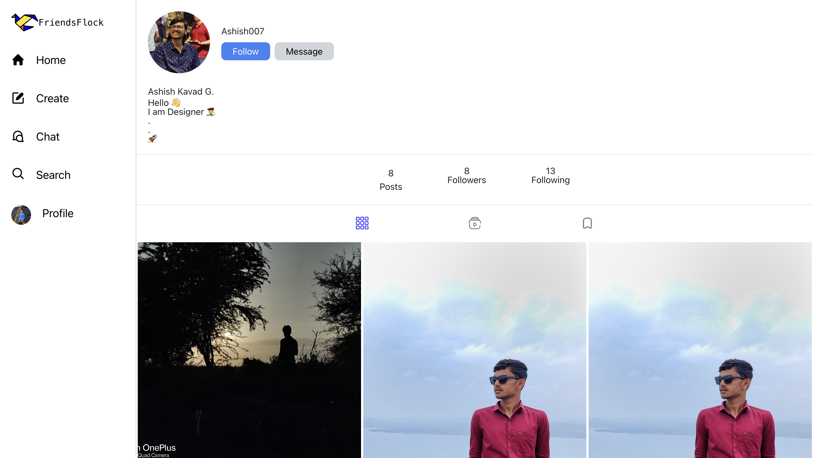

# Friends-Flock (Social Media Web Application)

Welcome to Friends-Flock a social media web application repository! This project is built using the MERN (MongoDB, Express.js, React.js, Node.js) stack.
And add real time chat facility using Socket.io

## Overview

This web application aims to provide users with a platform to connect, share, and interact with others in a social media environment. Users can create accounts, post updates, follow other users, like and comment on posts, and more.

## Features

- **User Authentication:** Users can sign up, log in, and securely authenticate their accounts.
- **Profile Management:** Users can edit their profiles, update profile pictures, and manage account settings.
- **Posts:** Users can create, edit, and delete posts. They can also like and comment on posts.
- **Follow System:** Users can follow other users to see their posts in their feed.
- **Real-time Updates:** The application provides real-time updates for new posts, likes, comments, and follows.

## Tech Stack

- **Frontend:** React.js, Tailwind CSS
- **Backend:** Node.js, Express.js
- **Database:** MongoDB
- **Authentication:** JSON Web Tokens (JWT)
- **Real-time Updates:** Socket.io

## Demo-pictures

Here are some screenshots of our social media web application:

## Setup

To set up this project locally, follow these steps:

1. Clone the repository: `git clone <repository-url>`
2. Install frontend dependencies: `npm install`
3. Set up environment variables from the `.env.example`
4. Start the development server: `npm run dev`
5. Navigate to the backend directory: `cd backend`
6. Install dependencies: `npm install`
7. Set up environment variables from the `.env.example`
8. Start the development server: `npm run dev`
9. Navigate to `http://localhost:<port-number>` in your browser.

## Contributing

We welcome contributions from the community! If you'd like to contribute to this project, please follow these steps:

1. Fork the repository.
2. Create a new branch: `git checkout -b feature/<feature-name>`
3. Commit your changes: `git commit -am 'Add new feature'`
4. Push to the branch: `git push origin feature/<feature-name>`
5. Submit a pull request.

## License

This project is licensed under the [MIT License](LICENSE).

## Contact

For any inquiries or support, feel free to contact us at [ranjeetjaimin6130@gmail.com](mailto:ranjeetjaimin6130@gmail.com).
